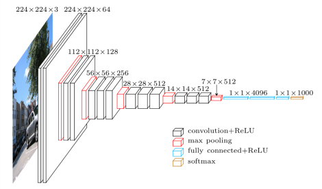

# Domain Description

1. **Neurological Examination**: It is a series of test to measures the function
   of the patients nervous system and also his/her physical and mental
   alertness.

. . .

2. **Machine Learning**: Machine learning approaches address these problems by
   mainly using hand-crafted features (or pre-defined features). As an initial
   step in this kind of segmentation, the key information is extracted from the
   input image using some feature extraction algorithm, and then a
   discriminative model is trained to recognize the tumor from normal tissues.

. . .

3. **Brain Scan**: Brain scan is a picture of the internal structure of the
   brain. A specialized machine takes a scan in the same way as a digital camera
   takes a photograph. Using computer technology, a scan compiles an image of
   the brain by photographing it from various angles. Some types of scan uses
   contrast agent (or contrast dye), which helps the doctor to see the
   difference between normal and abnormal brain tissues.

. . .

**MRI (Magnetic Resonance Imaging)**: It is a scanning device that uses magnetic
field and computer to capture images of the brain on films. It does not use
x-rays. It provides pictures from various planes, which permits doctor to create
a three-dimensional image of the tumor. The MRI detects signals emitted from
normal and abnormal tissues, providing clear images of almost all tumors.

# Motivation

The motivation is to develop a software with better segmentation capability for
use in medical imaging to detect diseases like brain tumor. Image segmentation
has been identified as the key problem of medical image analysis and remains a
popular and challenging area of research. Image segmentation is increasingly
used in many clinical and research applications to analyze medical imaging
datasets; which motivated us to present a snapshot of dynamically changing field
of medical image segmentation.

CT (Computed Tomography), MRI (Magnetic Resonance Imaging), PET (Positron
Emission Tomography) etc. generates a large amount of image information. With
the improved technology, not only does the size and resolution of the images
grow but also the number of dimensions increases. In the future, we would like
to have algorithms which can automatically detect diseases, lesions and tumors,
and highlight their locations in the large pile of images.

The motivation of this work is to increase patient safety by providing better
and more precise data for medical decision.

# Scope of Work

- Deliverables: Working program to take an MRI scan as input and predict presence of tumorous cells with $\geq$ 90% accuracy.

- Scope: The working program has external dependencies ( libraries ) and it’s expected to have a them installed for the program to work.

- Timeline
	- April 27, 2021 Project Assigned
    - May 2, 2021 Project finalized by supervisor, and group is divided into groups of two.
    - May 3, 2021 Data collection started.
    - May 12, 2021 Project Repository created and coding is started.
    - July 7, 2021 Coding is finished, documentation is started.
	- Just 21, 2021 Documentation complete.

# Background

We propose the use of ML algorithms to overcome the drawbacks of traditional
classifiers. We investigate and compare the performance of two machine learning
algorithms namely MLP and Naive Bayes in this work. Since these ML algorithms
are found to perform well in most of the pattern classification tasks. Neural
networks are useful as they can learn complex mappings between input and output.

They are capable of solving much more complicated classification tasks. However,
when certain rules cannot be modeled exactly, the concept of probability is
used, which is the basis for Naive Bayes classification.

# Methodology

## Image Acquisition

The MRI brain images are acquired and are given as input to pre-processing stage

{width=30%}

# Methodology

## Pre-processing

Preprocessing is needed as it provides improvement in image data which enhances
some of the image features which are important for further processing.

{width=20%}

# Methodology

## Feature Extraction

When input to an algorithm is very large and redundant to be processed, it is
transformed into reduced representative set of features called feature vector.

These features are extracted using Gray Level Co-occurrence Matrix (GLCM) as it
is robust method with high performance.

**Energy**

\begin{equation}
	E = \sum^{N_g - 1}_{i=0} \sum^{N_g - 1}_{j=0} p(i, j)^2 \
	\textnormal{ here, range = [0, 1] }
\end{equation}

**Contrast**

\begin{equation}
	Con = \sum^{N_g -1}_{n=0} n^2 \sum^{N_g -1}_{i=0} \sum^{N_g
	-1}_{j=0} p(i,j)^2 \
	\textnormal{ here, range = [0, 1] }
\end{equation}

# Methodology

## Feature Extraction

**Correlation**

\begin{equation}
	C = \frac{1}{\sigma^x \sigma^y}
	\sum^{N_g - 1}_{i=0} \sum^{N_g -1}_{j=0} (i,j) p(i,j)^2
	- \mu_x \mu_y \ \textnormal{here, range = [-1, 1]}
\end{equation}

**Homogeneity**

\begin{equation}
	H = \sum^{N_g -1}_{i=0} \sum^{N_g -1}_{j=0}
	\frac{p(i,j)}{1 + \pmod{i,j}}
	\ \textnormal{here, range = [0, 1]}
\end{equation}

# Methodology

## Classification

The Machine learning algorithms are used for classification of MR brain image
either as normal or abnormal.  The major aim of ML algorithms is to
automatically learn and make intelligent decisions.

For classification three models are used; **CNN**, **VGG 16** and **Resnet 50**.

# Methodology

## CNN

CNN or Convolutional Neural Network a class of artificial neural network, most
commonly applied to analyze visual imagery.They are also known as shift
invariant or space invariant artificial neural networks (SIANN), based on the
shared-weight architecture of the convolution kernels or filters that slide
along input features and provide translation equivariant responses known as
feature maps.

{width=30%}

# Methodology

## VGG 16

VGG 16 is is a significantly more accurate ConvNet architecture, which not only
achieve state-of-the-art accuracy on ILSVRC classification and localisation
tasks, but are also applicable to other image recognition datasets, where they
achieve excellent performance even when used as a part of a relatively simple
pipelines (e.g. deep features classified by a linear SVM without fine-tuning).

{width=30%}

# Methodology

## ResNet 50

ResNet50 is a variant of ResNet model which has 48 Convolution layers along with
1 MaxPool and 1 Average Pool layer. It has $3.8 x 10^9$ Floating points
operations. It is a widely used ResNet model and we have explored ResNet50
architecture in depth.

{width=50%}

# Implementation

## Assumption and Dependences

It is assumed that the MRI scans are collected and processed before feeding into
the module.

The program is dependent on external modules and are expected to be
pre-installed on the system. The modules namely include:

- fast.ai
- tensorflow
- OpenCV
- matplotlib

# Implementation

## Implementation Method

After acquiring the data, the data is classified into two classes (binary
class) of yes, consisting of tumorous cell and no, not consisting tumorous
cells. A second batch of images is kept separate for prediction, the
prediction batch.

Next three machine learning models are created. A \textbf{CNN} or a
convolutional neural network, \textbf{VGG 16} and \textbf{Resnet 50}. The
models are implemented in both fast.ai and tensorflow, to be compared later.

While training the images are resized to $(150 \times 150)$ and augmented at
runtime, thus removing bias as much as possible. Since there are only two
possible classes (yes and no), a binary class is sufficient; dividing the
images into training and testing (validation set) in $80:20$ ratio. Giving
us $2603 \ \textnormal{and} \ 650$ images for the \textit{yes} and
\textit{no} classes, respectively.

# Results

|   Model   | Implemented using Tensorflow | Implemented using fast.ai |
|:---------:|:----------------------------:|:-------------------------:|
|    CNN    |           $90.31%$           |          $92.66%$         |
|   VGG 16  |           $97.38%$           |          $98.16%$         |
| ResNet 50 |            $97.54$           |           $99%$           |

Table: Model accuracy.
