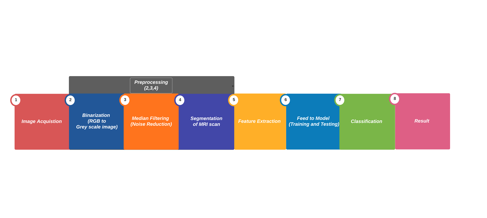

# Motivation

The motivation is to develop a software with better segmentation capability for
use in medical imaging to detect diseases like brain tumor. Image segmentation
has been identified as the key problem of medical image analysis and remains a
popular and challenging area of research. Image segmentation is increasingly
used in many clinical and research applications to analyze medical imaging
datasets; which motivated us to present a snapshot of dynamically changing field
of medical image segmentation.

The motivation of this work is to increase patient safety by providing better
and more precise data for medical decision.

# Domain Description

1. **Neurological Examination**: It is a series of test to measures the function
   of the patients nervous system and also his/her physical and mental
   alertness.

. . .

2. **Machine Learning**: Machine learning approaches address these problems by
   mainly using hand-crafted features (or pre-defined features).

. . .

3. **Brain Scan**: Brain scan is a picture of the internal structure of the
   brain. A specialized machine takes a scan in the same way as a digital camera
   takes a photograph.

# Background

We propose the use of ML algorithms to overcome the drawbacks of traditional
classifiers. We investigate and compare the performance of various machine
learning models, namely **CNN**, **VGG 16** and **ResNet 50**; implemented using
the frameworks Tensorflow and fast.ai.

# Methodology

<!---->

\begin{figure}[H]
	\centering
	\includegraphics[width=0.8\linewidth]{imgs/flowchart.png}
	\caption{Proposed Pre-processing}%
	\label{fig:imgs/flowchart}
\end{figure}

# Methodology

## Feature Extraction

When input to an algorithm is very large and redundant to be processed, it is
transformed into reduced representative set of features called feature vector.

These features are extracted using Gray Level Co-occurrence Matrix (GLCM) as it
is robust method with high performance.

# Methodology

## Classification

The Machine learning algorithms are used for classification of MR brain image
either as normal or abnormal.  The major aim of ML algorithms is to
automatically learn and make intelligent decisions.

For classification three models are used; **CNN**, **VGG 16** and **Resnet 50**.

# Methodology

## CNN

CNN or Convolutional Neural Network a class of artificial neural network, most
commonly applied to analyze visual imagery.They are also known as shift
invariant or space invariant artificial neural networks (SIANN), based on the
shared-weight architecture of the convolution kernels or filters that slide
along input features and provide translation equivariant responses known as
feature maps.

##

{width=30%}

# Methodology

## VGG 16

VGG 16 is is a significantly more accurate ConvNet architecture, which not only
achieve state-of-the-art accuracy on ILSVRC classification and localisation
tasks, but are also applicable to other image recognition datasets, where they
achieve excellent performance even when used as a part of a relatively simple
pipelines (e.g. deep features classified by a linear SVM without fine-tuning).

##

{width=30%}

# Methodology

## ResNet 50

ResNet50 is a variant of ResNet model which has 48 Convolution layers along with
1 MaxPool and 1 Average Pool layer. It has $3.8 x 10^9$ Floating points
operations. It is a widely used ResNet model and we have explored ResNet50
architecture in depth.

##

{width=50%}

# Implementation

## Assumption and Dependences

It is assumed that the MRI scans are collected and processed before feeding into
the module.

The program is dependent on external modules and are expected to be
pre-installed on the system. The modules namely include:

- fast.ai
- tensorflow
- OpenCV
- matplotlib

# Implementation

- Acquire Data (MRI Scans)
- Divide them into classes for training, while keeping a batch for prediction
- Build the models (using a library, through code)
- Train the model with the gathered data
- Test the trained model with the prediction batch

##

This is just an over view, a more detailed implementation is described in the
description.

# Results

|   Model   | Implemented using Tensorflow | Implemented using fast.ai |
|:---------:|:----------------------------:|:-------------------------:|
|    CNN    |           $90.31%$           |          $92.66%$         |
|   VGG 16  |           $97.38%$           |          $98.16%$         |
| ResNet 50 |            $97.54$           |           $99%$           |

Table: Model accuracy.

# Future Work

We further plan on implementing out experiments on other better machine learning
model such as **GAN**.

A generative adversarial network (GAN) is a class of machine learning frameworks
designed by Ian Goodfellow and his colleagues in 2014. Two neural networks
contest with each other in a game (in the form of a zero-sum game, where one
agent's gain is another agent's loss).

We also plan on increasing out dataset for better training results.
